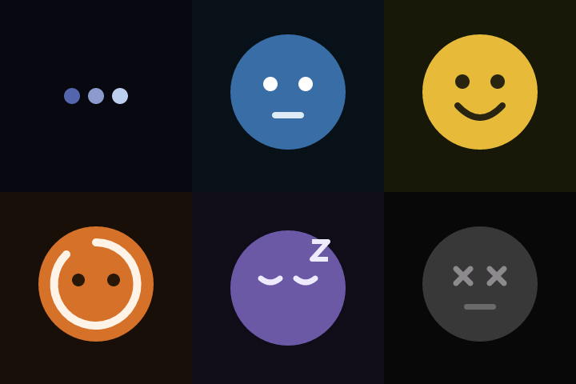

# Mascot animation verification

The editable [SVG master](../../assets/mascot.svg) preserves the blue body, shine, eyes, smile,
and cheeks from the original PNG. Source parts are named; there are no embedded bitmap images.

## Visual review

Rows read left to right: booting, idle, happy / busy, sleeping, offline.

Before (the previous full-screen placeholder SVGs):



After (canonical RGB565 renderer output at 600 ms):


The review export also produces `idle-life.png`, a five-frame strip showing gaze anticipation,
closed-eye expression swap, delighted hold, and closed-eye recovery with an unchanged body silhouette.

Goldens cover all six states at time zero, seeded idle gaze/expression samples, state-loop/blink
samples, and an idle → happy transition interrupted by sleeping at 250 ms. Regenerate the review
exports with:

```powershell
cargo run -p kivori-golden-frames --example mascot_review
python scripts/render-mascot-review.py
```

Exports go to ignored `assets/compiled/review`. Review them before changing committed hashes.
The original placeholder SVGs remain as before evidence and are no longer built into the default pack.

## Budgets

| Item | Result | Limit |
| --- | ---: | ---: |
| Complete compiled mascot blob | 116,634 bytes (113.9 KiB) | 131,072 bytes |
| Previous placeholder pixel pool alone | 691,200 bytes (675 KiB) | — |
| Animation controller | 92 bytes | 8 KiB additional animation working memory |
| Resolved pose | 32 bytes | Included in animation working memory |
| Device tile renderer | At most 4,096 bytes (compile-time enforced) | No second framebuffer |
| Physical-mode frame staging | 115,200 bytes (112.5 KiB), static SRAM | One complete prepared frame |
| Physical SPI buffers | 4,096-byte DMA TX + 4,096-byte encoding batch | No runtime allocation |

The new complete pack is about 84% smaller than the old pixel pool alone. The ESP32 never loads
SVG or PNG and never allocates a second full-screen framebuffer. Sprites remain borrowed from flash.

## Physical display cadence update (2026-09-08)

The firmware now divides the 240x240 panel into 40x40 update regions. A blink or facial change sends
only the affected regions; the SPI regression test proves an idle blink sends less than one third of a
complete 115,200-byte RGB565 frame. The idle, sleeping, and offline silhouettes stay stable between
expressions so nearest-neighbor body scaling cannot create crawling edges or force large-area transfers.

Expression transitions close the eyes, swap one face sprite, and reopen them. This avoids showing two
eye or mouth textures at once while keeping the body transition eased. Frame deadlines remain anchored
to the animation timeline and skip stale deadlines after a slow render instead of accumulating drift.
The asset blob is unchanged by these runtime changes.

### Compose before transfer

Physical ST7789 mode now uses one static RGB565 frame buffer. Composition and tile hashing finish
before the first display write; the old panel image remains visible while the next pose is prepared.
The renderer then sends only changed 40x40 tiles from that immutable prepared pose. A failed transfer
is not committed to the tile cache and will be retried. The host tests cover interrupted motion,
old-position clearing, failed-write recovery, and a late composition error that must send no pixels.

SPI2 now uses DMA channel 0 with a 4 KiB transmit buffer and a 4 KiB mipidsi encoding batch, enough to
send a 3,200-byte tile payload in one SPI write. The driver still waits for each transfer to complete;
it does not overlap drawing with transfer or provide an atomic panel framebuffer swap. The clock
remains the verified 20 MHz. This reduces compute pauses during visible updates but is not a promise
of tear-free output: the current wiring has no TE synchronization signal.

This approach intentionally increases physical-mode RAM use beyond the previous small-tile budget.
The frame is allocated in static storage rather than on the stack, and neither source artwork nor
additional animation frames are stored in flash. Physical visual quality and frame rate still require
installing this build and observing the screen; host tests cannot establish those results.

## Review in the native app

Start the frontend with `bun --filter kivori-desktop-ui dev`, then run `cargo run -p kivori-desktop`.
Open Device Studio, press Play, and switch expressions. Pause and scrub to replay transitions;
Restart preview clears the session history. The browser mock does not show the new character.

## Automated checks (2026-09-08)

- `cargo test --workspace`: 204 tests passed, including ACK clock mapping, asset goldens, compositor tests and native preview tests.
- `cargo clippy --workspace --all-targets -- -D warnings`: passed.
- Firmware host simulation: 36 tests passed, including runtime event/report behavior, local blink transfer and tile/frame parity.
- Physical ST7789 release firmware build: passed; one pre-existing unused doc-comment warning.
- Frontend tests (48), typecheck and production build: passed. ESLint has 28 pre-existing UI-component
  return-type warnings and no errors. Production mock exclusion passed.
- Native Kivori window launched and reported responsive. Desktop automation was unavailable, so
  live window interactions were not automatically verified.
- Repository-wide Prettier still reports 66 existing files outside this change; changed frontend files
  pass the focused formatting check. These unrelated files were left untouched.
- The Bash dependency checks require unavailable `jq`; equivalent checks of both workspaces using
  `cargo metadata` and PowerShell JSON parsing passed with the same prohibited-dependency lists.

## Device Studio first-open crash regression (2026-09-08)

Opening Device Studio exposed a Windows stack overflow (`0xc00000fd`) while decoding the bundled
manifest on the UI thread. The initial launch check and default-stack tests had not exercised this
constraint. Host-side decoding now runs once on a dedicated 2 MiB stack and returns a boxed manifest
to the cache; the temporary stack is released afterward. Firmware parsing and the asset pack are unchanged.

`preview_first_open` starts a fresh subprocess and initializes the assets and first animation frame
on a 1 MiB thread stack. It reproduced the crash before the fix and passes afterward, including cache
reuse. All 66 desktop tests pass. Native click-through remains unverified because desktop automation
is unavailable.

## Physical validation boundary

Native timing tests use a 33 ms per-frame threshold. The physical ESP32-C3/ST7789 firmware is
build-checked, but panel FPS, SPI transfer time, power consumption, and hardware playback are not
measured by host tests. No device is flashed as part of this change. The 30 FPS device target remains
subject to hardware measurement at the existing 20 MHz SPI clock.
