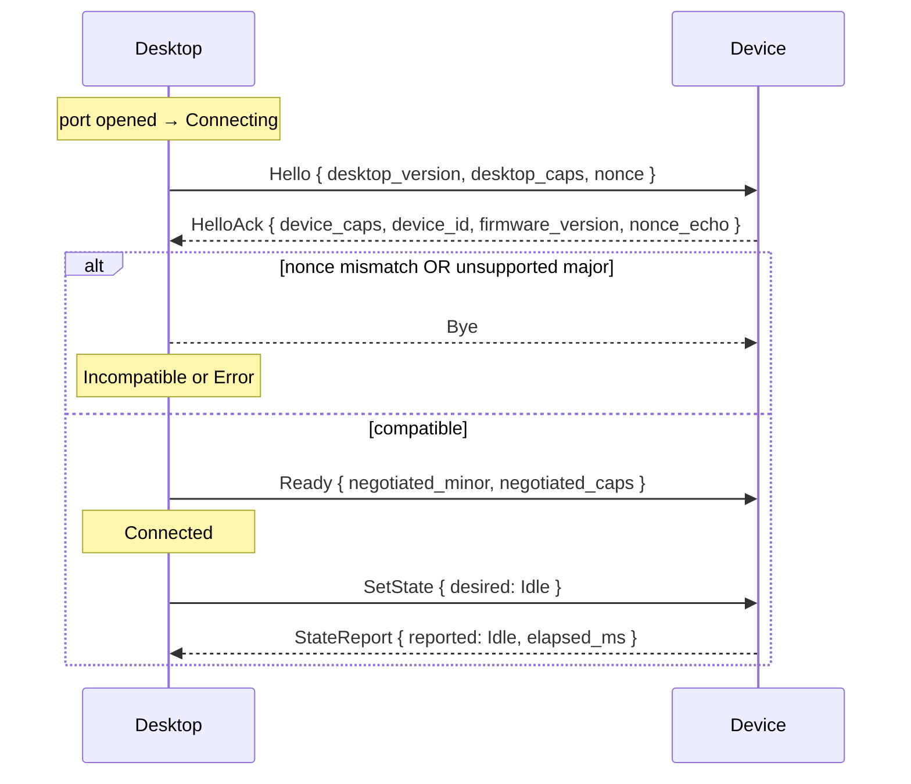

# Contract: Kivori Device Wire Protocol (USB Serial)

**Feature**: `001-device-connection-foundation` | **Date**: 2026-07-17 | **Crate**: `kivori-protocol`

Authoritative contract for the desktop-core ↔ ESP32-C3 link over USB serial. Both ends depend on the
**same** `kivori-protocol` crate so the schema cannot diverge. Recorded as **ADR-0002**.

> Scope: framing, versioning, handshake, message set, negotiation, integrity, and error handling for
> this slice. Wi-Fi/BT/OTA and integration payloads are out of scope for Feature 001.

## 1. Physical layer

- Transport: USB Serial/JTAG CDC-ACM (VID:PID `0x303A:0x1001`), treated as a byte-stream COM port. Baud
  is ignored by the device (runs at USB speed).
- Constraints: 64-byte endpoint FIFO per direction; device TX may stall if the host is not draining.
  → All frames are small (semantic, never pixels); writes are bounded and non-blocking.

## 2. Framing

Byte-stream framing uses **COBS** with a `0x00` delimiter. One wire packet = `COBS(frame) || 0x00`.

Decoded **frame** layout (all multi-byte fields **little-endian**):

| Offset | Field | Type | Notes |
|---:|---|---|---|
| 0 | `magic` | `u16` | `0x4B56` ("KV") |
| 2 | `ver_major` | `u16` | sender protocol major |
| 4 | `ver_minor` | `u16` | sender protocol minor |
| 6 | `seq` | `u16` | sequence number (wraps) |
| 8 | `payload_len` | `u16` | payload length; MUST be ≤ `MAX_PAYLOAD` (512) |
| 10 | `payload` | `[u8; payload_len]` | postcard-encoded `Message` |
| 10+len | `crc32` | `u32` | CRC-32 (IEEE) over header + payload |

`MAX_PAYLOAD = 512` bounds firmware buffers. Firmware reassembles frames across the USB FIFO using a bounded COBS accumulator.

## 3. Message set

`Message` is an **append-only** enum because postcard variant index is the wire tag. New compatible variants are appended within a major version and optional behavior is capability-gated. See [Feature 001 research R-6](../research.md#r-6-protocol-payloads-serde--postcard-in-one-shared-protocol-crate).

| Tag | Message | Dir | Payload (logical) |
|---:|---|---|---|
| 0 | `Hello` | D→V | `{ desktop_version, desktop_caps, nonce }` |
| 1 | `HelloAck` | V→D | `{ device_caps, device_id, firmware_version, nonce_echo }` |
| 2 | `Ready` | D→V | `{ negotiated_minor, negotiated_caps }` |
| 3 | `Bye` | both | `{ reason }` |
| 4 | `SetState` | D→V | `{ desired: SendableState, at_ms }` |
| 5 | `StateReport` | V→D | `{ reported: CompanionState, elapsed_ms }` |
| 6 | `Ping` | D→V | `{ t_ms }` |
| 7 | `Pong` | V→D | `{ t_ms_echo, uptime_ms }` |
| 8 | `Health` | V→D | safe health fields |
| 9 | `Diagnostic` | V→D | `{ category, code }` |
| 10 | `Error` | both | `{ category, code }` |

Frame-version fields are outside the postcard payload so major compatibility can be checked before decoding an incompatible payload.

## 4. Handshake

- Identity is established only after a well-formed `HelloAck` matching the handshake nonce. VID/PID filtering alone is not Kivori identity verification.
- If `HelloAck` does not arrive before `HANDSHAKE_TIMEOUT`, the attempt fails, backs off, and returns to discovery/retry behavior.

## 5. Version and capability negotiation

- Compatible iff the device major is supported by Desktop.
- Unsupported major → `Incompatible`; normal state commands are not sent.
- `negotiated_minor = min(desktop_minor, device_minor)`.
- `negotiated_caps = desktop_caps & device_caps`.
- Unknown/unnegotiated capabilities must not activate behavior.

| Desktop | Device | Result |
|---|---|---|
| same supported major | same major | compatible; negotiate minor + caps |
| unsupported major | other major | incompatible |
| minor differs | same major | compatible additive behavior only |
| cap set on one peer only | unset on other | feature disabled |

## 6. Sequence numbers and integrity

Each outbound frame carries an incrementing wrapping `u16` sequence number. USB CDC already provides ordered transport, so sequence tracking is for duplicate/gap diagnostics and side-effect suppression, not generic retransmission.

- Duplicate sequence: do not re-apply side effects; record diagnostic evidence.
- Gap: accept the newer valid frame and record the gap; do not invent/retransmit missing ordinary input/state.
- Wraparound `0xFFFF → 0x0000`: valid continuation.
- CRC failure: drop/count, never dispatch.
- `Pong.t_ms_echo` correlates the matching ping.

This sequence policy is **not** sufficient for a future firmware-image transfer protocol; update transfer requires its own explicit transaction/offset/ack semantics if application-level flashing is selected.

## 7. Heartbeat and liveness

Feature 001 defines ping/pong support and heartbeat policy constants. The production Desktop wiring must be verified before relying on heartbeat timeout as a complete product-health mechanism; current product-wide technical research tracks that as an implementation evidence item.

Initial constants:

| Name | Value |
|---|---:|
| `HANDSHAKE_TIMEOUT` | 1000 ms |
| `PING_INTERVAL` | 1000 ms |
| `HEARTBEAT_MISSES` | 3 |

## 8. Malformed-frame and resync handling

The decoder must safely reject malformed input without panic/hang/mis-dispatch:

- COBS failure or overlong accumulation;
- wrong magic;
- unexpected/unsupported header version;
- payload length over bound;
- truncated frame;
- CRC mismatch;
- postcard decode failure/unknown variant;
- message invalid for the current session phase.

The decoder must continue making forward progress and resynchronize at future frame boundaries.

## 9. Initial protocol constants

| Name | Value | Meaning |
|---|---|---|
| `PROTOCOL_MAJOR` | 1 | current major |
| `PROTOCOL_MINOR` | 0 | current minor |
| `MAGIC` | `0x4B56` | frame magic |
| `MAX_PAYLOAD` | 512 | max postcard payload bytes |
| `HANDSHAKE_TIMEOUT` | 1000 ms | handshake deadline |
| `PING_INTERVAL` | 1000 ms | heartbeat period |
| `HEARTBEAT_MISSES` | 3 | configured miss threshold |

## 10. Verification

Feature 001 maintains automated tests for:

- round-trip encode/decode of message variants;
- header/framing/COBS/CRC/payload-length validation;
- version/capability negotiation;
- duplicate/gap/wrap sequence classification;
- malformed/random byte handling with no panic and forward progress;
- firmware/host-simulation consumption of the shared contract.

See `crates/kivori-protocol/tests/` and `tests/e2e-host-sim/` for current executable evidence.
