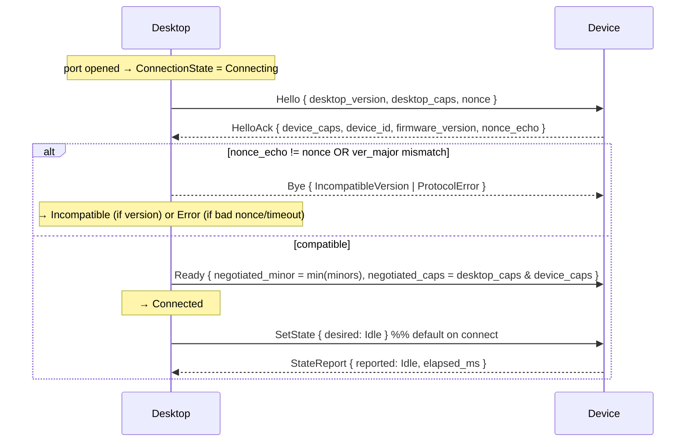

# Contract: Kivori Device Wire Protocol (USB Serial)

**Feature**: `001-device-connection-foundation` | **Date**: 2026-07-17 | **Crate**: `kivori-protocol`

Authoritative contract for the desktop-core ↔ ESP32-C3 link over USB serial. Both ends depend on the
**same** `kivori-protocol` crate so the schema cannot diverge. Recorded as **ADR-0002**.

> Scope: framing, versioning, handshake, message set, negotiation, integrity, and error handling for
> this slice. Wi-Fi/BT/OTA and integration payloads are out of scope (Principle XII).

## 1. Physical layer

- Transport: USB Serial/JTAG CDC-ACM (VID:PID `0x303A:0x1001`), treated as a byte-stream COM port. Baud
  is ignored by the device (runs at USB speed).
- Constraints: 64-byte endpoint FIFO per direction; device TX may stall if the host is not draining.
  → All frames are small (semantic, never pixels); writes are bounded and non-blocking.

## 2. Framing

Byte-stream framing uses **COBS** with a `0x00` delimiter (self-synchronizing; enables resync after
corruption). One wire packet = `COBS(frame) || 0x00`.

Decoded **frame** layout (all multi-byte fields **little-endian**):

| Offset | Field | Type | Notes |
|-------:|-------|------|-------|
| 0 | `magic` | `u16` | `0x4B56` ("KV") — cheap Kivori sanity check |
| 2 | `ver_major` | `u16` | sender's protocol major |
| 4 | `ver_minor` | `u16` | sender's protocol minor |
| 6 | `seq` | `u16` | sequence number (wraps) |
| 8 | `payload_len` | `u16` | length of `payload` in bytes; MUST be ≤ `MAX_PAYLOAD` (512) |
| 10 | `payload` | `[u8; payload_len]` | `postcard`-encoded `Message` |
| 10+len | `crc32` | `u32` | CRC-32 (IEEE) over bytes `[0 .. 10+payload_len)` |

- `MAX_PAYLOAD = 512` bounds buffers for `no_std` firmware (`heapless`).
- The firmware uses a COBS accumulator to reassemble frames from 64-byte FIFO reads.

## 3. Message set

`Message` is an **append-only** `enum`; the `postcard` variant index is the wire tag. New variants are
appended at the end within a major version; older peers ignore unnegotiated features (postcard has no
field tags — see [research §R-6](../research.md#r-6-protocol-payloads-serde--postcard-no_std)).

| Tag | Message | Dir | Payload (logical) |
|----:|---------|-----|-------------------|
| 0 | `Hello` | D→V | `{ desktop_version, desktop_caps: Capabilities, nonce: u32 }` |
| 1 | `HelloAck` | V→D | `{ device_caps: Capabilities, device_id: [u8;16], firmware_version, nonce_echo: u32 }` |
| 2 | `Ready` | D→V | `{ negotiated_minor: u16, negotiated_caps: Capabilities }` |
| 3 | `Bye` | both | `{ reason: ByeReason }` |
| 4 | `SetState` | D→V | `{ desired: SendableState, at_ms: Option<u32> }` |
| 5 | `StateReport` | V→D | `{ reported: CompanionState, elapsed_ms: u32 }` |
| 6 | `Ping` | D→V | `{ t_ms: u32 }` |
| 7 | `Pong` | V→D | `{ t_ms_echo: u32, uptime_ms: u32 }` |
| 8 | `Health` | V→D | `{ free_bytes: u32 }` (safe diagnostics only) |
| 9 | `Diagnostic` | V→D | `{ category: ErrorCategory, code: u16 }` (safe only) |
| 10 | `Error` | both | `{ category: ErrorCategory, code: u16 }` |

`ver_major`/`ver_minor` live in the **frame header** (not the payload) so version can be checked before
attempting to `postcard`-decode a possibly-incompatible payload.

`ByeReason ∈ { IncompatibleVersion, Shutdown, ProtocolError }`.
`ErrorCategory ∈ { Io, Handshake, Version, Framing, Checksum, Timeout, Busy, BadPayload }`.

## 4. Handshake

- **Identity** is established **only** by a well-formed `HelloAck` with matching `nonce_echo` (FR-002,
  FR-004). VID/PID pre-filtering is not sufficient.
- **Handshake timeout**: if `HelloAck` does not arrive within `HANDSHAKE_TIMEOUT` (1000 ms) → `Error`,
  backoff, rescan.

## 5. Version & capability negotiation

- **Compatibility (clarified)**: compatible **iff** `device.ver_major ∈ desktop.supported_majors`.
  Otherwise → `Incompatible` (send `Bye{IncompatibleVersion}`; do not send further messages; stop
  re-handshaking that device until it is removed/changed — no retry spam).
- **Minor**: `negotiated_minor = min(desktop_minor, device_minor)`. Minor differences are permitted only
  via **backward-compatible, additive** behavior gated by capabilities.
- **Capabilities**: `negotiated_caps = desktop_caps & device_caps` (bitwise-AND). A feature is active
  only if both sides advertise its bit. Unknown/higher bits are ignored (append-only evolution).
- **Compatibility matrix**:

| Desktop | Device | Result |
|---------|--------|--------|
| major = M | major = M | Compatible; negotiate minor + caps |
| supports {M} | major = M-1 or M+1 | `Incompatible` |
| minor = a | minor = b | Compatible; use `min(a,b)` behavior + intersected caps |
| cap bit set | cap bit unset | Feature disabled for the session |

## 6. Sequence numbers & integrity

- Each outbound frame carries an incrementing `seq` (`u16`). Receivers record `last_rx_seq`. USB CDC is
  reliable and in-order at the transport level, so `seq` is a protocol-policy signal, not a reliability
  mechanism. **Sequence policy** (explicit, and tested as valid decoded frames — not as malformed bytes):
  - **Duplicate** (`seq == last_rx_seq`): treat as a duplicate — record a diagnostic and do not
    re-apply side effects (e.g., never double-apply a `SetState`).
  - **Gap** (`seq` skips ahead): accept the frame (no retransmit/reordering) and increment a gap
    diagnostic counter. Gaps are informational, not fatal.
  - **Wraparound** (`u16` rolls `0xFFFF → 0x0000`): normal continuation; MUST be handled as valid, not
    treated as a gap or error.
- **CRC-32 (IEEE)** over the header+payload MUST validate; a bad CRC frame is dropped and counted
  (`ErrorCategory::Checksum`), never dispatched.
- `Pong.t_ms_echo` echoes the matching `Ping.t_ms` for round-trip correlation.

## 7. Heartbeat & liveness

- Desktop sends `Ping` every `PING_INTERVAL` (1000 ms).
- Device replies `Pong` promptly (and may piggy-back `Health`).
- Missing `HEARTBEAT_MISSES` (3) consecutive `Pong` → desktop declares link loss (`HeartbeatTimeout`) →
  `Error`/`Disconnected` → reconnect. Complements serial I/O-error detection (a wedged-but-present device
  is caught by the heartbeat).

## 8. Malformed-frame & resync handling (FR-034, SC-008)

The decoder MUST treat all of the following as safe, counted drops — **never** panics, hangs, or
mis-dispatches:

- COBS decode failure / no delimiter within `MAX_FRAME` → discard to next `0x00`, resync.
- `magic` mismatch → drop, resync.
- Invalid/unsupported **header version**: at handshake an unsupported *major* → `Incompatible` (§5);
  mid-session, a frame whose header version is unexpected → drop + `Version` diagnostic (never dispatch).
- `payload_len > MAX_PAYLOAD` → drop (guards against buffer overrun / desync).
- Truncated frame (fewer bytes than `10 + payload_len + 4`) → wait or drop on delimiter.
- CRC mismatch → drop (`Checksum`).
- `postcard` decode error / unknown variant tag → drop (`BadPayload`).
- Unexpected message for the current `ConnectionState` (e.g., `SetState` before `Ready`) → ignore +
  diagnostic.

A property/fuzz test feeds arbitrary byte streams and asserts the decoder never panics and always makes
forward progress (SC-008).

## 9. Constants (initial)

| Name | Value | Meaning |
|------|-------|---------|
| `PROTOCOL_MAJOR` | 1 | current major |
| `PROTOCOL_MINOR` | 0 | current minor |
| `MAGIC` | `0x4B56` | frame magic |
| `MAX_PAYLOAD` | 512 | max payload bytes |
| `HANDSHAKE_TIMEOUT` | 1000 ms | Hello→HelloAck deadline |
| `PING_INTERVAL` | 1000 ms | heartbeat period |
| `HEARTBEAT_MISSES` | 3 | missed Pongs → link loss (~3 s) |

These satisfy SC-001 (<5 s connect), SC-002 (<10 s reconnect), and SC-004 (<1 s state latency) with wide
margin. Values are tunable but fixed for the compatibility matrix within major 1.

## 10. Testing hooks (see [test strategy](./../plan.md#test-strategy))

- Round-trip encode/decode for every `Message` variant.
- Framing/COBS + CRC + `payload_len` bound tests.
- Version matrix (§5) and capability intersection tests.
- Malformed/fuzz corpus (§8) → no panic, forward progress.
- Host-side firmware handler consumes this exact contract over an in-memory byte pipe (FR-035).
