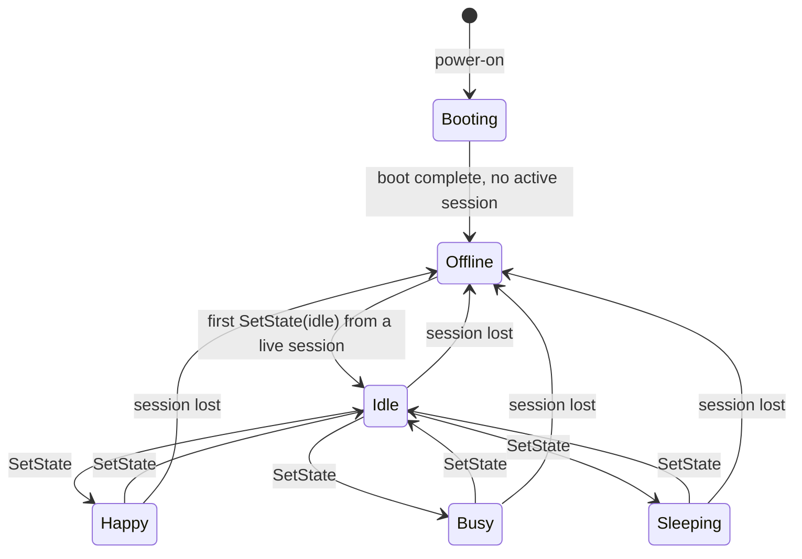
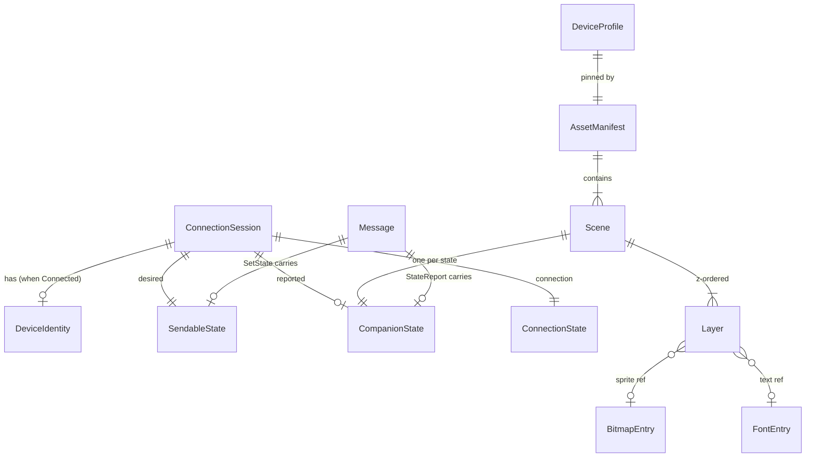

# Data Model: Device Connection Foundation

**Feature**: `001-device-connection-foundation` | **Date**: 2026-07-17

Design-level entities, enums, relationships, validation rules, and state transitions. Type sketches show
**shape**, not implementation. Canonical home crate is noted per entity. Wire encoding lives in
[contracts/protocol.md](./contracts/protocol.md); IPC shapes in [contracts/ipc.md](./contracts/ipc.md).

Conventions: all rendering-facing numeric types are **integers** (no float in `kivori-model`/renderer).
Coordinates are `i16`/`u16` pixel units. Colors are RGB565.

---

## 1. Companion states

**Crate**: `kivori-model`

```rust
// Six semantic states total.
enum CompanionState { Booting, Idle, Happy, Busy, Sleeping, Offline }

// The four the DESKTOP may send (clarified).
enum SendableState { Idle, Happy, Busy, Sleeping }

// The two the DEVICE originates (clarified).
enum LifecycleState { Booting, Offline }
```

- **Relationship**: `SendableState` and `LifecycleState` are disjoint subsets of `CompanionState`;
  together they cover all six. `SendableState → CompanionState` is total and injective.
- **Validation**:
  - The desktop MUST only transmit `SendableState` (FR-012, FR-015). Attempting to "send" `Booting` or
    `Offline` is a compile-time impossibility (separate type), not a runtime check.
  - Device Studio may **preview** all six `CompanionState` (FR-023) but **mirror** only `SendableState`
    (FR-027).
- **Device lifecycle transitions** (owned by firmware, FR-014):



(Any `SendableState`→`SendableState` transition is allowed; the diagram elides the full mesh for
readability. `Offline`/`Booting` are only ever entered by the device, never by a `SetState`.)

## 2. Connection lifecycle

**Crate**: `kivori-model` (enum) + `apps/desktop/src-tauri` (the running machine)

```rust
enum ConnectionState { Disconnected, Connecting, Connected, Incompatible, Error }
```

- These are the exactly-five UI statuses (FR-005). Internal `Scanning` maps to `Disconnected`.
- **Distinct axis** from `CompanionState` (a device can be `Connected` while showing `Idle`, or
  `Disconnected` while the device shows its own `Offline`).
- **Transitions**: see plan [connection state machine](./plan.md#connection-state-machine). Events:
  `PortAppeared`, `HandshakeOk`, `HandshakeIncompatible`, `HandshakeTimeout`, `IoError`,
  `HeartbeatTimeout`, `PortRemoved`, `BackoffElapsed`.
- **Validation**: `Incompatible` is terminal for that device until it is removed/changed (no
  re-handshake spam). `Error` always routes through backoff → `Disconnected` before retry.

## 3. Protocol version & capabilities

**Crate**: `kivori-model` (types) + `kivori-protocol` (negotiation)

```rust
struct ProtocolVersion { major: u16, minor: u16 }

// Additive feature flags negotiated within a major version.
struct Capabilities(u32);  // bitflags; unknown bits ignored by older peers
```

- **Validation / compatibility rule (clarified)**:
  - Compatible iff `device.major` ∈ `desktop.supported_majors`. Else → `Incompatible`.
  - `negotiated_minor = min(desktop.minor, device.minor)`.
  - `negotiated_caps = desktop_caps ∩ device_caps` (intersection); features act only when both advertise.
  - Evolution is **append-only** (postcard has no field tags): new capability bits and new message-enum
    variants are appended; older peers ignore unnegotiated features.
- **Relationship**: `Capabilities` gate optional message variants/fields; `negotiated_caps` is stored on
  the `ConnectionSession`.

## 4. Connection session

**Crate**: `apps/desktop/src-tauri` (runtime, in-memory only — not persisted)

```rust
struct ConnectionSession {
    connection: ConnectionState,
    desired: SendableState,          // desktop-owned; default Idle; reset on app restart
    reported: Option<CompanionState>,// last StateReport from device (read-only mirror)
    device: Option<DeviceIdentity>,  // populated after HelloAck
    negotiated_version: Option<ProtocolVersion>,
    negotiated_caps: Capabilities,
    tx_seq: u16,                     // next outbound sequence number (wraps)
    last_rx_seq: Option<u16>,        // last accepted inbound sequence
    last_pong_at: Option<Instant>,   // heartbeat liveness
    retry_count: u32,                // reconnect attempts (safe-diagnostic)
    backoff: Duration,               // current backoff interval
}
```

- **Validation / invariants**:
  - `desired` is always a `SendableState`; on a fresh process it is `Idle` (clarified).
  - `reported` may be any `CompanionState` (incl. device-originated); it is display/diagnostic only and
    never overwrites `desired`.
  - `device`, `negotiated_version`, `negotiated_caps` are `None`/empty unless `connection == Connected`.
  - `tx_seq` increments per outbound frame; heartbeat and resync reuse the same counter.
- **The three axes** (`desired`, `reported`, `connection`) are surfaced separately over IPC and never
  conflated (see [contracts/ipc.md](./contracts/ipc.md)).

```rust
struct DeviceIdentity {
    opaque_id: [u8; 16],   // never a customer-unique raw id in logs; hashed before logging
    firmware_version: SemVerLite,
    protocol_version: ProtocolVersion,
}
```

## 5. Timeline (rendering time input)

**Crate**: `kivori-model` (canonical `elapsed_ms`) + `apps/desktop` Device Studio (step index)

```rust
type ElapsedMs = u32;                 // canonical, integer milliseconds

struct StudioTimeline {               // Device Studio only (ephemeral, Zustand)
    step_index: i64,                  // integer; source of truth for stepping
    playing: bool,
    play_origin: Option<Instant>,     // fixed origin for play mode (derive, never accumulate)
}
// elapsed_ms(step_index) = (step_index * 1000 + 15) / 30   // 30 Hz inspection, drift-free
```

- **Validation**: `elapsed_ms` is always derived (from `step_index` or `now − play_origin`), never
  summed with `+33.333`. `step_index` may be negative only transiently while scrubbing; clamped to ≥ 0
  before rendering. See [ADR-0003](./plan.md#adrs-required).

## 6. Scene model (canonical visual definition)

**Crate**: `kivori-model` (shape) + `kivori-assets` (compiled payload)

```rust
struct Scene {
    id: CompanionState,          // one scene per state
    fps: FrameRate,              // per-scene effective frame rate (integer ratio)
    frame_count: u16,            // frames in the loop (0/1 = static)
    layers: &'static [Layer],    // z-ordered; borrowed from the compiled blob
    background: Rgb565,
}

struct FrameRate { num: u16, den: u16 }   // e.g., 12/1, 30/1; integer ratio (no float)

struct Layer {
    kind: LayerKind,             // Sprite | Text | SolidRect
    origin: Point,               // integer coords
    timeline: &'static [Keyframe],
}

struct Keyframe { at_ms: u32, frame: u16, offset: Point, visible: bool }

enum LayerKind {
    Sprite { asset: AssetId },   // index into compiled bitmap table
    Text   { font: FontId, string_id: StringId },
    SolidRect { size: Size, color: Rgb565 },
}

struct Point { x: i16, y: i16 }
struct Size  { w: u16, h: u16 }
struct Rgb565(u16);              // canonical runtime color
```

- **Relationships**: `Scene 1..* Layer`; each `Layer` references compiled assets by index
  (`AssetId`/`FontId`/`StringId`) resolved through `kivori-assets`. `frame` for a given `elapsed_ms` is
  chosen by integer math from `fps`/keyframes (plan [per-scene frame selection](./plan.md#per-scene-animation-frame-selection)).
- **Validation**: coordinates within `DeviceProfile` bounds; `frame < frame_count`; `at_ms` keyframes
  sorted ascending; all `AssetId`/`FontId`/`StringId` resolvable in the loaded blob (checked at asset-
  compile time and asserted on load).

## 7. Device profile

**Crate**: `kivori-model`

```rust
struct DeviceProfile {
    width: u16,        // 240
    height: u16,       // 240
    color: ColorFormat // Rgb565
    controller: PanelController, // Gc9a01 | St7789 (configurable)
    tile: TileConfig,  // tile/scanline band geometry
}
struct TileConfig { tile_w: u16, tile_h: u16 } // e.g., 240×40 scanline band or 40×40 tiles
```

- **Validation**: `width % tile_w == 0` and `height % tile_h == 0` (tiles tile the frame exactly).
- Preview and firmware MUST use the **same** `DeviceProfile` for a given build (Principle II).

## 8. Framebuffer & dirty regions

**Crate**: `kivori-framebuffer`

```rust
struct TileBand<'a> { rect: Rect, pixels: &'a mut [Rgb565] } // caller-provided storage
struct Rect { x: u16, y: u16, w: u16, h: u16 }
struct TileSignature(u64);  // content hash per tile for change detection
```

- **Validation**: `pixels.len() == rect.w * rect.h`; `rect` within `DeviceProfile` bounds and
  tile-aligned.
- **Relationship**: firmware keeps one `TileSignature` per tile of the last flush; a tile is flushed
  only if its recomputed signature differs (change-driven). Host preview ignores signatures (full-frame).

## 9. Compiled assets (runtime)

**Crate**: `kivori-assets` (runtime reader) — produced by `tools/asset-compiler`

```rust
struct AssetManifest {
    format_version: u16,
    profile: DeviceProfile,
    bitmaps: &'static [BitmapEntry],   // RGB565 sprite frames
    fonts:   &'static [FontEntry],     // compiled bitmap fonts
    strings: &'static [StrEntry],      // externalized UI-independent device strings
    scenes:  &'static [Scene],
    hash: [u8; 32],                    // determinism guard (matches committed manifest)
}
struct BitmapEntry { id: AssetId, size: Size, data_offset: u32, data_len: u32 } // RGB565 payload
struct FontEntry { id: FontId, glyph_table_offset: u32, /* bitmap glyphs */ }
```

- **Validation**: the runtime `hash` MUST equal the committed manifest hash (Principle XI/III; CI
  enforced). `data_offset+data_len` within the blob bounds; every referenced `AssetId/FontId` present.
- **Relationship**: `Scene.layers[*]` → `BitmapEntry`/`FontEntry` by id. Source SVG/PNG is **never**
  referenced at runtime (FR-021).

## 10. Protocol messages (logical)

**Crate**: `kivori-protocol` (wire layout in [contracts/protocol.md](./contracts/protocol.md))

```rust
enum Message {                 // append-only enum (postcard variant index = wire tag)
    Hello(Hello),              // desktop → device
    HelloAck(HelloAck),        // device → desktop
    Ready(Ready),              // desktop → device
    Bye(Bye),                  // either
    SetState(SetState),        // desktop → device  { desired: SendableState, at_ms: Option<u32> }
    StateReport(StateReport),  // device → desktop  { reported: CompanionState, elapsed_ms: u32 }
    Ping(Ping),                // desktop → device  { t_ms: u32 }
    Pong(Pong),                // device → desktop  { t_ms_echo: u32, uptime_ms: u32 }
    Health(Health),            // device → desktop  { free_bytes: u32, /* safe */ }
    Diagnostic(Diagnostic),    // device → desktop  { category, code }  (safe only)
    Error(ProtoError),         // either            { category, code }
}
```

- **Validation**: every inbound frame validated for framing, `payload_len` bound, CRC, and sequence
  before dispatch; malformed frames are dropped + counted, never panic (FR-034, SC-008). `SetState`
  payload is a `SendableState` (device rejects out-of-range variant tags safely).

## 11. Diagnostic event

**Crate**: `apps/desktop/src-tauri` (+ firmware compact form)

```rust
struct DiagnosticEvent {
    at: Timestamp,
    connection: ConnectionState,
    category: ErrorCategory,   // Io | Handshake | Version | Framing | Checksum | Timeout | Busy
    message_type: Option<MsgType>,
    payload_len: Option<u16>,
    seq: Option<u16>,
    retry_count: u32,
    elapsed: Duration,
    device_id_hash: Option<[u8; 8]>,  // hashed identity only
    // NEVER: raw payload bytes, raw device id, usernames/paths, tokens, secrets
}
```

- **Validation**: field set is restricted to the **safe-diagnostics allowlist** (plan
  [logging policy](./plan.md#diagnostics-structured-logging--sensitive-data-policy)); an automated test
  asserts no sensitive field can be populated outside a `debug-payloads` dev build (SC-010, ADR-0005).

---

## Entity relationship overview


