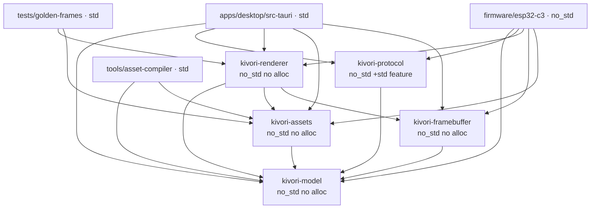
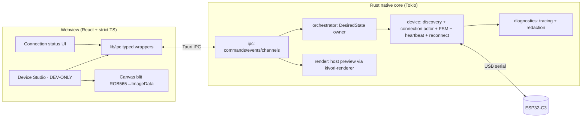
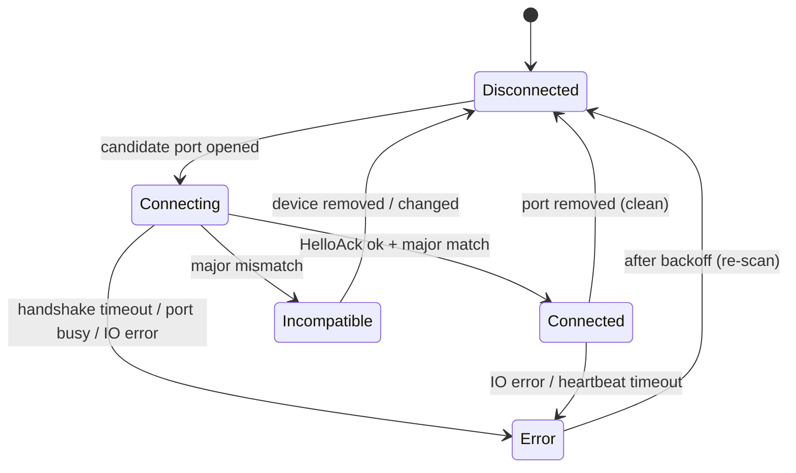

# Implementation Plan: Device Connection Foundation

**Branch**: `001-device-connection-foundation` | **Date**: 2026-07-17 | **Spec**: [spec.md](./spec.md)

**Input**: Feature specification from `specs/001-device-connection-foundation/spec.md`

**Companion artifacts**: [research.md](./research.md) · [data-model.md](./data-model.md) ·
[contracts/protocol.md](./contracts/protocol.md) · [contracts/ipc.md](./contracts/ipc.md) ·
[quickstart.md](./quickstart.md)

## Summary

Deliver the first Kivori vertical slice: a Windows Tauri v2 desktop application that automatically
discovers one ESP32-C3 device over USB serial, verifies it via a versioned handshake, drives four
semantic companion states (`idle`, `happy`, `busy`, `sleeping`), recovers automatically after
unplug/reconnect, and previews every state in a development-only Device Studio. The device and the
Device Studio preview share **one** deterministic renderer (`kivori-renderer`) operating on an integer
millisecond timebase; the browser Canvas is only a blit surface for RGB565 pixels produced in Rust.
Firmware is `no_std`, renders in tiles/scanlines with change-driven refresh (no full framebuffer), and
owns only lifecycle states (`booting`, `offline`), protocol handling, storage, rendering, and health.

The technology stack, monorepo layout, and the twelve architecture decisions are authoritative inputs
from the feature request; they are recorded below and de-risked in [research.md](./research.md). This
plan stops at design — no product code is written.

## Technical Context

**Languages/Versions**: Rust (edition 2021; host + `no_std` embedded target
`riscv32imc-unknown-none-elf`); TypeScript (strict) on the frontend.

**Primary Dependencies**:
- Desktop core: Tauri v2 (GA), Tokio, `tokio-serial` (async serial; blocking `serialport` +
  `spawn_blocking` documented fallback for Windows overlapped-I/O), `tracing`.
- Frontend: React, Vite, Tailwind CSS, shadcn/ui, Zustand (ephemeral Device Studio controls only),
  TanStack Query (async native state caching/invalidation).
- Firmware: `esp-hal` 1.0 (`no_std`), `esp-hal-embassy` (if async), `embedded-hal`, `mipidsi`
  (`embedded-graphics`-compatible, windowed writes), ESP32-C3 **native USB Serial/JTAG**
  (`esp_hal::usb_serial_jtag`, VID:PID `0x303A:0x1001`; note: behind esp-hal's `unstable` feature).
- Shared: `serde` + `postcard` (payloads; stable wire format, `no_std`, no `alloc`), COBS framing,
  `crc`, `heapless`.
- Asset tooling (host): `resvg`/`usvg` + `tiny-skia` (deterministic rasterization), `image`.

**Storage**: No persistent feature state — desired state is in-memory only and **not** persisted across
restart (clarified). Compiled assets are read-only blobs (device flash; bundled/`include_bytes!` on
desktop). Optional local rolling diagnostics log (non-sensitive only).

**Testing**: `cargo test` (host unit/integration, golden-frame, protocol codec, connection state
machine, host-side firmware-logic simulation); Vitest + Testing Library + axe (frontend + a11y);
documented manual ESP32-C3 hardware procedure (physical automation unavailable).

**Target Platform**: Windows 10/11 desktop; ESP32-C3 firmware. Linux/macOS documented, not implemented.

**Project Type**: Monorepo — Tauri desktop app + ESP32-C3 firmware + shared Rust crates + asset tooling.

**Performance Goals** (Success Criteria): discover+connect < 5 s; reconnect+restore < 10 s; incompatible
surfaced < 5 s; state→device < 1 s; 0 pixel diff host↔device; 0 nondeterministic test failures; 100%
malformed-frame safety.

**Constraints**: `no_std` with no runtime `alloc` for every crate consumed by firmware; no full 240×240
framebuffer on device (tile/scanline + change-driven refresh); integer-only rendering math (no float in
the renderer); offline-first (zero network dependency); webview gets no raw serial/filesystem/shell
access; sensitive data never logged.

**Scale/Scope**: One device, one transport (USB serial), one platform (Windows), six states (4 sendable
+ 2 device-originated), 240×240 RGB565.

**Resolved unknowns** (see [research.md](./research.md)): all confirmed against current libraries (July
2026). No `NEEDS CLARIFICATION` markers remain. Items that genuinely require physical hardware to
confirm (USB throughput, TX-stall behavior, display FPS, Windows async-serial reliability, end-to-end
latency, esp-hal `unstable` API drift) are tracked as risks R1–R3/R11 and in the hardware procedure.

## Constitution Check

*GATE: must pass before Phase 0 and be re-verified after Phase 1 design.*

| # | Principle | Compliance in this plan | Status |
|---|-----------|-------------------------|--------|
| I | Product experience first | Calm/ambient states; Device Studio dev-only, excluded from release; connection UI is non-intrusive status, not a dashboard. | ✅ |
| II | One canonical visual model | Single `kivori-renderer` compiled for host preview **and** firmware; Canvas is blit-only (constraints 1–3, FR-016/018). | ✅ |
| III | Deterministic rendering | Integer-ms timebase, pure renderer, no float; golden-frame + frame-hash tests on Windows **and** Linux CI (FR-019, FR-033). | ✅ |
| IV | Hardware-conscious design | `no_std`, no runtime `alloc`, no full framebuffer, tile/scanline + change-driven refresh, memory budget, separate embedded workspace (FR-013). | ✅ |
| V | Desktop owns orchestration | Desktop owns discovery, desired state, reconnect, negotiation; firmware owns protocol/render/health + lifecycle states (constraint 6, FR-014). | ✅ |
| VI | Semantic events, not draw commands | Wire carries semantic `SetState` only; pixels/coords/draw-commands never transmitted (FR-015, constraint 5). | ✅ |
| VII | Offline-first / local-first | No network dependency anywhere; USB + local rendering only (FR-029). | ✅ |
| VIII | Safe boundaries | Webview reached only via typed Tauri commands/events/channels — no raw serial/fs/shell; sensitive-data logging policy; no secrets in this slice. See note. | ✅ |
| IX | Vertical feature delivery | Slice spans model + desktop + firmware + tests + docs, phased by user story (P1→P4). | ✅ |
| X | Testable hardware contracts | Codec/renderer/state-machine tests + host-side firmware simulation + documented hardware procedure (FR-033/034/035). | ✅ |
| XI | Source assets are not runtime assets | `tools/asset-compiler` emits compiled RGB565/bitmap-font blobs; runtime never parses SVG/PNG (FR-021). | ✅ |
| XII | Controlled scope | Windows + USB serial only; Wi-Fi/BT/OTA/cloud/plugins/AI explicitly out (FR-036 + Non-Goals). | ✅ |

**Principle VIII note**: The constitution's "local APIs bind to localhost and require authentication"
targets network-bound local APIs. This slice exposes **no** network socket — the only IPC is Tauri's
in-process bridge and the device link is USB serial. The active obligations are (a) least-privilege,
explicitly-enumerated Tauri commands (no raw serial/fs/shell to the webview) and (b) the sensitive-data
logging policy — both satisfied. A future localhost control API would trigger the bind+auth rule then.

**Quality gates**: strict Rust (`clippy -D warnings`, `rustfmt`), strict TS (`strict`, no implicit
`any`, ESLint + Prettier), documented public contracts (Rustdoc/TSDoc + `contracts/`), zero-warning CI,
ADRs for irreversible choices ([ADRs required](#adrs-required)).

**Result**: PASS (initial). Re-verified post-design — see [Post-Design Constitution Re-Check](#post-design-constitution-re-check).

## Project Structure

### Documentation (this feature)

```text
specs/001-device-connection-foundation/
├── plan.md              # This file
├── research.md          # Phase 0: dependency/target research & decisions
├── data-model.md        # Phase 1: entities, enums, state transitions
├── contracts/
│   ├── protocol.md      # Device USB-serial wire contract (framing, handshake, messages, versioning)
│   └── ipc.md           # Desktop-core ↔ webview Tauri command/event/channel contract
├── quickstart.md        # Phase 1: setup, dev commands, validation scenarios, hardware procedure
└── checklists/
    └── requirements.md  # Spec quality checklist (from /speckit-specify)
```

### Source Code (monorepo root)

```text
kivori/
├── Cargo.toml                    # ROOT Cargo workspace (host targets only)
├── pnpm-workspace.yaml           # pnpm workspace (frontend + shared UI)
├── rust-toolchain.toml           # host toolchain
├── justfile                      # dev command recipes
├── .github/workflows/            # CI: host, frontend, firmware, determinism
│
├── apps/
│   └── desktop/
│       ├── src/                  # React + strict TS frontend (pnpm package)
│       │   ├── features/connection/       # status UI (a11y)
│       │   ├── features/device-studio/    # DEV-ONLY (build-flag gated)
│       │   ├── lib/ipc/                    # typed wrappers over Tauri commands/events/channels
│       │   └── lib/canvas/                 # RGB565→ImageData blit ONLY (no drawing logic)
│       ├── src-tauri/            # Rust native core (member of ROOT Cargo workspace)
│       │   ├── src/
│       │   │   ├── device/        # discovery, connection actor, state machine, heartbeat, reconnect
│       │   │   ├── orchestrator/  # owns DesiredState; maps controls/events → semantic state
│       │   │   ├── render/        # host-side preview rendering (kivori-renderer)
│       │   │   ├── ipc/           # Tauri commands/events/channels (least-privilege surface)
│       │   │   └── diagnostics/   # tracing setup + sensitive-data redaction layer
│       │   ├── Cargo.toml
│       │   └── tauri.conf.json
│       ├── package.json
│       └── vite.config.ts
│
├── crates/                       # SHARED Rust crates (root workspace; no_std where firmware-consumed)
│   ├── kivori-model/             # core types; no_std, no alloc
│   ├── kivori-assets/            # compiled-asset runtime reader; no_std, no alloc
│   ├── kivori-framebuffer/       # tile/scanline RGB565 buffer + dirty regions; no_std, no alloc
│   ├── kivori-renderer/          # deterministic renderer; no_std, no alloc
│   └── kivori-protocol/          # framing/codec/versioning/negotiation; no_std (+ std feature)
│
├── firmware/
│   └── esp32-c3/                 # SEPARATE embedded Cargo workspace (path-deps into crates/*)
│       ├── Cargo.toml            # [workspace] isolated from root (feature-unification firewall)
│       ├── .cargo/config.toml    # target riscv32imc-unknown-none-elf, espflash runner
│       ├── rust-toolchain.toml   # embedded toolchain + riscv target
│       └── src/                  # bsp, transport, proto, state, render, health, clock
│
├── packages/
│   └── ui/                       # shared shadcn/ui component library (pnpm package)
│
├── tools/
│   └── asset-compiler/           # HOST std bin: layered SVG → deterministic compiled RGB565/font blobs
│
├── tests/
│   └── golden-frames/            # golden RGB565 dumps + frame-hash manifest + determinism harness
│
├── assets/                       # SOURCE authoring inputs (layered SVGs + animation metadata)
│
└── docs/
    ├── adr/                      # Architectural Decision Records
    ├── architecture.md
    └── diagnostics-and-logging.md
```

**Structure Decision**: Monorepo with a **two-workspace Cargo split** (host root workspace + isolated
firmware embedded workspace, path-linked) plus a pnpm workspace for the frontend. Rationale in
[Workspace boundaries](#workspace-boundaries).

## Workspace boundaries

### Cargo: two workspaces, path-linked

**Decision**: ESP32-C3 firmware lives in its **own** Cargo workspace at `firmware/esp32-c3/`, consuming
the shared crates through **path dependencies**. It is **not** a member of the root workspace.

**Rationale**: A single Cargo workspace unifies feature flags across all members and shares one profile
set/target dir. Unifying features across a `std` host (Tokio, Tauri) and a `no_std` embedded target is
hazardous — a host member enabling a `std`/`alloc` feature on a shared crate would silently break the
firmware's `no_std` build — and the embedded target needs its own `panic`, target triple, and
`.cargo/config.toml` runner. A separate firmware workspace is the standard mixed host/embedded pattern
and forms a hard **feature-unification firewall**; path deps keep one source of truth with no
publishing. Recorded as **ADR-0001**.

- **Root workspace members**: `crates/*`, `apps/desktop/src-tauri`, `tools/asset-compiler`,
  `tests/golden-frames`.
- **Firmware workspace members**: `firmware/esp32-c3` (+ firmware-only helpers), path-deps →
  `crates/{kivori-model, kivori-protocol, kivori-renderer, kivori-framebuffer, kivori-assets}`.

### Cargo package names (locked)

Package names are fixed so `cargo -p <name>` commands resolve consistently across tasks and CI:

| Path | `package.name` | Kind |
|------|----------------|------|
| `apps/desktop/src-tauri` | `kivori-desktop` | bin (Tauri core) |
| `firmware/esp32-c3` | `kivori-firmware` | bin (`no_std`) |
| `crates/kivori-model` | `kivori-model` | lib |
| `crates/kivori-protocol` | `kivori-protocol` | lib |
| `crates/kivori-framebuffer` | `kivori-framebuffer` | lib |
| `crates/kivori-renderer` | `kivori-renderer` | lib |
| `crates/kivori-assets` | `kivori-assets` | lib |
| `tools/asset-compiler` | `kivori-asset-compiler` | bin (host) |
| `tests/golden-frames` | `kivori-golden-frames` | test harness |

### pnpm workspace

Members: `apps/desktop` (frontend package) and `packages/ui` (shared components). `src-tauri` is Rust
(Cargo root workspace), not pnpm.

## Shared-crate dependency direction & no_std/alloc policy

Dependencies form a DAG (arrows = "depends on"); no cycles. No shared crate depends on Tauri, serial,
OS, or ESP APIs (constraint 4).



| Crate | `no_std` | Runtime `alloc` | Notes |
|-------|----------|-----------------|-------|
| `kivori-model` | Yes | **No** | Enums, scene model, `Rgb565`, integer coords, version, capabilities. Strictest tier. |
| `kivori-assets` | Yes | **No** | Zero-copy reader over a borrowed `&[u8]` compiled blob. Compiler is separate (std). |
| `kivori-framebuffer` | Yes | **No** | Tile/scanline RGB565 buffers, address-window/dirty-region primitives, caller-provided storage. |
| `kivori-renderer` | Yes | **No** | Pure deterministic renderer; integer/fixed-point only; writes into a framebuffer tile. |
| `kivori-protocol` | Yes | Optional (`std`/`alloc` feature, desktop only) | Fixed-buffer `heapless` codec for firmware; `Vec` ergonomics behind `std`. |

**Policy**: crates consumed by firmware MUST build `no_std` with **no global allocator**. `std`/`alloc`
convenience lives behind non-default features used only by desktop/host. Firmware aims for **zero heap**;
if an embedded dependency forces `alloc`, it is isolated to the firmware crate with a bounded allocator,
never pushed into shared crates. CI compiles every shared crate for the embedded target to enforce this
(guards Principle IV).

**Direct-dependency firewall**: shared `crates/kivori-*` MUST NOT list `tauri`, `tokio`, `serialport`,
`tokio-serial`, `axum`, `tower`, `sqlx`, or OS-specific desktop crates as **direct** dependencies. This
is enforced by a lightweight architecture check on first-party manifests (see tasks), in addition to the
embedded-target compile. The check inspects *direct* dependencies only and does not reject legitimate
transitive crates unless they activate `std`/desktop features in a shared crate.

## Desktop application architecture

Tauri v2 app: a Rust **native core** (single OS process, one Tokio multi-thread runtime) plus a React
webview. All device access is in the core; the webview is a least-privilege consumer.



- **device**: owns the serial port (`tokio-serial`, or blocking `serialport` in `spawn_blocking` if
  Windows async proves flaky — see R2); runs the discovery loop, connection state machine, heartbeat,
  and reconnect/backoff as an async actor; talks to the rest via `tokio::sync` channels; codecs via
  `kivori-protocol`.
- **orchestrator**: single owner of `DesiredState` (in-memory). Device Studio and manual controls set
  it now; future integrations emit semantic events into it without changing the wire contract.
- **render**: host-side preview via the **same** `kivori-renderer`; produces canonical RGB565 → RGBA8888
  and returns/streams it to the webview.
- **ipc**: the *entire* privileged surface exposed to the webview (see [contracts/ipc.md](./contracts/ipc.md));
  no raw serial/filesystem/shell.
- **diagnostics**: `tracing` + a redaction layer enforcing the sensitive-data policy; optional rolling
  file log (non-sensitive only).

**Frontend state**: Zustand holds **only** ephemeral Device Studio control state (selected state,
timeline position, play/pause). TanStack Query caches/invalidates async native reads (status,
diagnostics). Live status and preview frames arrive via Tauri events/channels.

## Desktop lifecycle & background operation (FR-030 / SC-007)

Kivori is an always-present companion, so the desktop **process** outlives any window. The native core
owns the device session; the React window is a detachable view.

- **Close ≠ quit**: closing the main settings window **hides** it; it does not terminate the application.
- **Background continuity**: while the window is hidden, the Tauri process and the native core — serial
  connection manager, heartbeat, reconnect loop, orchestration/behavior, and device synchronization —
  keep running unchanged.
- **Explicit Quit**: a distinct, explicit Quit action (menu/tray/command) is the only path that
  terminates the application.
- **Single instance + reopen**: launching Kivori again activates the existing single instance and shows
  the main window rather than starting a second process (Tauri single-instance).
- **Ownership boundary**: the connection manager and device task are spawned on the core's Tokio runtime
  and are **not** owned by the React window lifecycle. Unexpected loss of the webview (crash/reload) MUST
  NOT terminate the native device task; the task keeps the link alive and the reloaded webview
  re-attaches over IPC.
- **Tray (optional)**: a system-tray icon MAY expose Open and Quit; it is a convenience, not the
  mechanism — the core requirement is continued background operation regardless of tray availability.

**Testability**: the hide-vs-quit / show-on-reactivate decision is factored into a pure, host-testable
policy (`window_lifecycle.rs`) validated without driving a real OS window; the end-to-end "hidden window
keeps heartbeat + sync alive, reopen restores UI" behavior is a `[MANUAL]` OS check because direct Tauri
window automation is impractical. This resolves the FR-030/SC-007 coverage gap.

## Firmware architecture (ESP32-C3, no_std)

```text
firmware/esp32-c3/src/
├── main.rs        # init, run loop / embassy tasks
├── bsp.rs         # clocks, SPI display (mipidsi) pins, USB Serial/JTAG bring-up
├── transport.rs   # USB serial byte I/O (64-byte FIFO aware) + COBS frame accumulator
├── proto.rs       # handshake responder, dispatch, seq/crc validation, capability advertise
├── state.rs       # device lifecycle FSM (booting→offline/driven); applies SetState; emits StateReport
├── render.rs      # tile/scanline draw via kivori-renderer + kivori-framebuffer; dirty-region flush
├── health.rs      # uptime, free-mem (safe), Pong
└── clock.rs       # monotonic hardware timer → elapsed_ms (u32) for rendering
```

- **Owns** device-originated lifecycle: `booting` at power-on, `offline` when powered-but-not-driven;
  applies the desktop's desired state only while an active session drives it (FR-014, constraint 6).
- **Render loop** is change-driven: recompute the current frame's tiles for `elapsed_ms`; flush only
  tiles whose content changed since last flush (per-tile signature), via `mipidsi` windowed writes
  (`set_pixels`). No full 240×240 framebuffer retained (FR-013, Principle IV).
- USB Serial/JTAG has a 64-byte FIFO and can stall TX if the host is not draining — mitigated by small
  frames (semantic state, not pixels) and bounded, non-blocking writes (R2).
- **Never** contains integration logic; only protocol, storage, rendering, health (Principle V).

## Device connection design

Wire details in [contracts/protocol.md](./contracts/protocol.md); state/entity fields in
[data-model.md](./data-model.md). Summary:

### Discovery & candidate-port filtering

1. Enumerate serial ports (`tokio-serial`/`serialport::available_ports`), reading USB VID/PID
   (`SerialPortType::UsbPort { vid, pid, .. }`) on Windows.
2. **Pre-filter** candidates by a configurable VID/PID allowlist. ESP32-C3 native USB Serial/JTAG =
   **`0x303A:0x1001`**. External UART bridges (CP210x/CH34x) differ, so the allowlist is configurable
   with a manual dev override.
3. VID/PID is only a pre-filter to avoid poking unrelated devices — **identity is authoritative only via
   a successful handshake** (FR-002/FR-004). Non-matching or handshake-failing ports are never reported
   as connected.

### Handshake sequence

```mermaid
sequenceDiagram
    participant D as Desktop core
    participant V as Device (ESP32-C3)
    D->>V: Hello {protocol{major,minor}, desktop_caps, desktop_version, nonce}
    V-->>D: HelloAck {protocol{major,minor}, device_caps, device_id(opaque), fw_version, nonce_echo}
    alt major mismatch
        D-->>V: Bye {reason: IncompatibleVersion}
        Note over D: state → Incompatible (surface; stop retrying this device)
    else compatible
        D->>V: Ready {negotiated_minor = min(minors), negotiated_caps = agreed additive set}
        Note over D: state → Connected; begin SetState + heartbeat
        D->>V: SetState {desired: idle}
    end
```

### Protocol version & capability negotiation

- **Compatibility rule (clarified)**: compatible iff **major versions match** a desktop-supported major;
  different major → `Incompatible`.
- **Minor**: negotiated minor = `min(desktop_minor, device_minor)`. Minor differences are allowed only
  via **backward-compatible additive** behavior gated by **capabilities** (feature flags both sides
  advertise). Because `postcard` is not self-describing, schema evolution is **append-only**: new
  message-enum variants and fields are added at the end within a major version, and older peers ignore
  features they didn't negotiate. Recorded as **ADR-0002**.

### Incompatible-device behavior

On major mismatch: set `Incompatible`, present a clear message (expected major *X*, device reports *Y*),
send `Bye`, do **not** send state commands, stop re-handshaking that device until it changes (no retry
spam). The undriven device shows its own `offline`/`booting` screen.

### Connection state machine



UI exposes exactly the five spec statuses: `connecting`, `connected`, `incompatible`, `disconnected`,
`error` (FR-005). Internal `Scanning` surfaces as `disconnected`.

### Disconnect detection strategy

Layered — the serial crate provides **no native device-removal event** on Windows, so detection does not
rely on one:
1. **Serial I/O failure** (read/write error, handle invalidated) → immediate disconnect. Primary signal.
2. **Periodic heartbeat timeout** — desktop `Ping` ~1 s; *N* missed `Pong` (≈3 → ~3 s) declares link
   loss even without an I/O error (catches a wedged device). Secondary signal.
3. **Port-list polling / OS `WM_DEVICECHANGE`** — diffing `available_ports()` and, on Windows,
   optionally registering for `WM_DEVICECHANGE` at the app level — both treated purely as **latency
   optimizations** to react faster; never the sole detector.

### Reconnect backoff & state resynchronization

- Exponential backoff with jitter between rescans: 250 ms → 500 ms → 1 s → 2 s → cap 5 s; reset on
  success. Prevents unplug/replug thrash (FR-010, US3 §2).
- **Resync (same process)**: after reconnect handshake, re-send the current in-memory `DesiredState`
  (e.g., `busy`) so the device returns to it (FR-009, US3). Reported state converges.
- **Restart semantics (clarified)**: full app restart starts `DesiredState = idle`; transient state is
  never persisted.

### Three independent state axes

Kept strictly separate in code and IPC (see [data-model.md](./data-model.md)):

| Axis | Owner | Values | Persisted? |
|------|-------|--------|------------|
| **Desired companion state** | Desktop | `idle`, `happy`, `busy`, `sleeping` | In-memory; default `idle`; reset on restart |
| **Reported device state** | Device → desktop (read-only) | any of six incl. `booting`, `offline` | No |
| **Connection lifecycle state** | Desktop | `connecting`/`connected`/`incompatible`/`disconnected`/`error` | No |

## Rendering & timing design

### Millisecond timebase & drift-free 33.333 ms step

- **Canonical timebase**: `elapsed_ms: u32` integer milliseconds. Renderer is a pure function
  `render(scene, elapsed_ms, assets) -> pixels` (no wall-clock, no float — FR-019).
- **Device Studio step**: 1/30 s = 33.333… ms is not an integer, so it is **never accumulated**. Device
  Studio holds an integer **step index** `n: i64`; canonical time is *derived*: `elapsed_ms =
  (n * 1000) / 30` (integer division; `(n*1000 + 15)/30` for rounding). Recomputing from `n` gives
  **zero cumulative drift**: `n=1→33`, `2→66`, `3→100`, …, `30→1000`, exactly periodic every 30 steps.
  Stepping changes `n` by ±1; scrubbing sets `elapsed_ms`/`n` directly; **play** derives `elapsed_ms`
  from a fixed origin (`now − start`), never summed in float. Recorded as **ADR-0003**.

### Per-scene animation frame selection

Each scene declares its **own** effective frame rate / keyframe timeline in the model. The renderer maps
canonical `elapsed_ms` → the scene's active frame via integer math (e.g.,
`frame = (elapsed_ms * fps_num) / (1000 * fps_den) mod frame_count`, or keyframe lookup by ms bounds).
The 30 Hz Studio step is only the *inspection cadence*; animation speed is per-scene and fully
determined by `elapsed_ms`.

### Change-driven & dirty-region rendering (RGB565 tile/scanline)

- The renderer writes RGB565 into a caller-provided **tile/scanline band** (`kivori-framebuffer`); never
  requires a full-frame buffer.
- **Temporal** change-driven: if `elapsed_ms` maps to the same logical frame as last flush, nothing is
  redrawn/flushed (a still idle pose costs no SPI traffic).
- **Spatial** dirty regions: per-tile content signature; only changed tiles re-render and push to the
  display via windowed writes. Desktop preview renders the full frame (host RAM) through the identical
  renderer, so outputs match bit-for-bit at the RGB565 level.

### Desktop preview frame transport (Rust → Canvas)

- Rust renders canonical RGB565, then expands to RGBA8888 (lossless bit-replication) **in Rust** so the
  Canvas is a pure blit surface (`ctx.putImageData`) that never draws device content (constraint 2).
- Transport: single-frame requests return raw bytes via **`tauri::ipc::Response`** (arrives as an
  `ArrayBuffer`, no JSON/base64); **play** mode streams frames over a Tauri v2 **`Channel`**. The event
  system and base64 are avoided (perf). Determinism is asserted at the **RGB565** layer (golden frames),
  not the RGBA presentation copy. See [research.md](./research.md) §7 for perf caveats (per-frame copy +
  RGB565→RGBA convert; measure FPS).

## Asset pipeline

- **Source (authoring) inputs** in `assets/`: layered SVGs per scene (background/body/eyes/mouth …) plus
  animation metadata (per-layer keyframes, per-scene frame rate) in RON/JSON. Placeholder artwork only.
  Never loaded at runtime (Principle XI, FR-021).
- **`tools/asset-compiler`** (host, std): deterministically rasterizes SVG layers (`resvg`/`tiny-skia`)
  to RGB565 bitmaps, packs bitmap fonts, emits a compiled binary blob + manifest consumed by
  `kivori-assets`. **Deterministic**: pinned rasterizer versions, fixed rounding, stable ordering, no
  timestamps → byte-reproducible. Recorded as **ADR-0004**.
- **Consumption**: firmware embeds the blob in flash; desktop bundles it; `kivori-assets` reads it
  zero-copy (`no_std`).
- **Determinism guard**: CI recompiles assets and diffs the output hash against the committed manifest.

## Test strategy

Concrete, mapped to requirements/criteria. Commands in [quickstart.md](./quickstart.md).

| Layer | What | Where | Guards |
|-------|------|-------|--------|
| Unit | `kivori-model` state transitions, version-compat, capability negotiation math | `crates/kivori-model` | FR-003, FR-011/012 |
| Golden-frame / frame-hash | Render each state at fixed `elapsed_ms` samples → compare RGB565 bytes + hash manifest; Windows **and** Linux CI | `tests/golden-frames` | FR-019/033, SC-005/009 |
| Timing | `elapsed_ms = n*1000/30` drift-free over long `n`; per-scene frame selection integer math | `crates/kivori-renderer` | FR-019, SC-011 |
| Protocol codec | Round-trip every message; COBS framing; CRC; seq | `crates/kivori-protocol` | FR-034 |
| Malformed-frame / fuzz | Truncated, bad CRC/COBS, oversized `payload_len`, desync/resync, arbitrary bytes never panic | `crates/kivori-protocol` | FR-034, SC-008 |
| Version matrix | major match/mismatch, minor negotiation, capability intersection | `crates/kivori-protocol` | FR-003 |
| Connection FSM | Inject events (port up, handshake ok/incompatible/timeout, IO error, heartbeat timeout, port removed) → assert transitions, backoff, resync | `apps/desktop/src-tauri` | FR-005/007/008/009/010 |
| Host-side firmware logic | Firmware `proto`/`state`/`render`/dirty-region compiled for host; in-memory byte-pipe transport + capture display target; stitched tiles == golden full-frame | firmware crate `#[cfg(test)]` (host) | FR-035, SC-005 |
| IPC contract & redaction | Command shapes; automated scan that emitted logs contain no raw payload bytes / username paths | `apps/desktop/src-tauri` | FR-031/032, SC-010 |
| Frontend + a11y | Controls behavior; keyboard operability, visible focus, labels (axe); Canvas blit given known bytes | `apps/desktop` (Vitest) | A11y reqs, constraint 2 |
| Hardware (manual) | Flash, discover, handshake, cycle states, unplug/replug recovery, latency + visual parity | documented procedure | SC-001–004, US1–US3 |

**Why host-side firmware simulation**: physical automation is unavailable in CI, so all device *logic*
(protocol, state, tile rendering, dirty regions) is compiled for the host and tested against the shared
golden frames; only true integration is left to the manual hardware procedure (Principle X, FR-035).

## Physical ESP32-C3 validation procedure

Repeatable manual checklist (full version in [quickstart.md](./quickstart.md)): flash via `espflash`;
launch desktop; confirm auto-discovery without port selection and `connecting→connected` (SC-001);
verify protocol/fw version shown; cycle `idle/happy/busy/sleeping` and confirm the device matches Device
Studio for the same state (SC-005 spot-check); confirm device-originated `booting` at power-on and
`offline` when the desktop closes; unplug during `busy`, confirm `disconnected`, replug, confirm auto-
reconnect and restoration of `busy` (SC-002); connect a deliberately wrong-major build → confirm
`incompatible`. Record measured latencies and the hardware-validation numbers from
[research.md](./research.md).

## Platform behavior

### Windows serial-device behavior (implemented)

- COM naming (`COM10+` needs `\\.\COM10`; the crate handles it); serial ports are **exclusive** → report
  `error` on access-denied when busy; the C3's native CDC enumerates as "USB Serial Device (COMx)" via
  `usbser.sys`.
- **No native serial device-removal event** — detect unplug via I/O error, heartbeat timeout, and
  `available_ports()` polling; `WM_DEVICECHANGE` app-level registration is an optional optimization.
- **ESP32 DTR/RTS gotcha**: DTR/RTS drive the auto-reset circuit; opening the port with the wrong
  control-line state can reset the chip or drop it into the bootloader. The core sets DTR/RTS explicitly
  on open to avoid resetting the device. Covered in the hardware procedure.
- **Async reliability**: if `tokio-serial` overlapped-I/O proves flaky on Windows, fall back to blocking
  `serialport` inside `tokio::task::spawn_blocking` (documented in research; behind a small internal
  transport trait so the swap is local).

### Linux/macOS (documented, not implemented)

`/dev/ttyACM*` (Linux, udev/`dialout`) and `/dev/cu.usbmodem*` (macOS). Enumeration/filtering sits behind
a small platform trait so future targets slot in without touching the state machine. No Linux/macOS code
ships this slice (FR-036, Principle XII).

## CI workflows

`.github/workflows/`:
1. **host.yml** (Windows + Linux): `cargo fmt --check`, `clippy -D warnings`, `cargo test` (all host
   crates incl. golden-frames, codec, FSM, host firmware-logic), `cargo build` desktop core; frontend
   `pnpm install`, `tsc --noEmit`, ESLint, Prettier check, Vitest + axe, `vite build`.
2. **firmware.yml**: install `riscv32imc-unknown-none-elf`; in the firmware workspace `cargo fmt
   --check`, `clippy -D warnings`, `cargo build` (compile-only — no flashing). Enforces `no_std`/no-alloc
   of shared crates on the real embedded target.
3. **determinism.yml**: golden-frame hashes on Windows **and** Linux asserted equal; recompile assets and
   assert the blob hash matches the committed manifest.
4. Zero-warning gate across all jobs (constitution).

## Development commands

Via a `justfile` + pnpm scripts (full list in [quickstart.md](./quickstart.md)): `pnpm install`;
`just dev` (`tauri dev`, Device Studio enabled); `just test`; `just assets` (compile + hash-check);
`just fw-build` / `just fw-flash` (firmware workspace, espflash); `just lint`. All offline (FR-029).

## Diagnostics, structured logging & sensitive-data policy

- Desktop: `tracing` with structured fields, an in-app diagnostics view, optional rolling local file
  (non-sensitive only). Firmware: compact safe diagnostics over the protocol's diagnostic message +
  optional `defmt` on the debug link.
- A **redaction layer** enforces the policy at the logging boundary; device identity is hashed before it
  reaches any log field. Full policy in `docs/diagnostics-and-logging.md`, reproduced here:

**Sensitive data — never logged**: serial payload contents not explicitly classified as safe
diagnostics; device identifiers that could uniquely identify a customer unit; local API tokens;
filesystem paths containing usernames; credentials and secrets; future integration payloads; crash dumps
containing raw protocol buffers.

**Safe diagnostics — allowed**: redacted or hashed device identity; protocol major/minor version;
connection state; error category; message type; payload length; sequence number; retry count; elapsed
duration; firmware and desktop application versions.

**Raw payload bytes are NOT logged by default.** Debug payload logging requires an explicit
developer-only build/setting (`debug-payloads` feature) and is **compiled out of release builds**. An
automated test scans emitted logs for policy violations (SC-010). Recorded as **ADR-0005**.

## Accessibility & localization

Applies to the desktop Device Studio and connection-status UI (not the 240×240 device imagery in this
feature): all controls keyboard-operable, visible focus states, accessible labels/roles (shadcn/ui +
Radix primitives help), UI strings in an external catalog (i18n-ready). **Full localization is not
required yet.** Covered by automated tests (axe + keyboard-nav) in the frontend suite.

## Offline runtime boundary (FR-029 / SC-006)

Every core behavior in this feature works with **no internet access** and no external service:

- Core startup, device discovery, handshake, state changes, rendering, Device Studio, reconnect, the
  settings this feature needs, and the host-simulation test path all run fully offline.
- **No** external/remote API, CDN-hosted frontend asset, telemetry endpoint, or cloud account may be
  required by any core path.
- Frontend fonts, icons, scripts, styles, and runtime assets are **bundled locally** (Vite bundles; no
  remote `<link>`/`@import`/`<script src>` to a CDN).
- Core behavior MUST NOT block on a network timeout before becoming usable — there is no network call on
  any startup or connection path.

**Verification** (see tasks): a direct-dependency check that no first-party crate in this feature lists a
network-client crate as a *direct* dependency (transitive crates used internally by Tauri are not
banned); a frontend-asset scan for remote URLs/CDN references; and an offline host smoke test that boots
the native core + host-sim device with no external services. This resolves the FR-029/SC-006 gap.

## Risks & mitigations

| # | Risk | Impact | Mitigation |
|---|------|--------|------------|
| R1 | ESP32-C3 can't meet frame/latency at full-frame refresh | Sluggish device; misses SC-004 | Tile + dirty-region + temporal change-driven refresh; per-scene rate; measure on hardware early |
| R2 | USB Serial/JTAG throughput / 64-byte FIFO / TX-stall-when-host-not-draining; Windows async-serial reliability | Drops, resync churn, wedged TX | Small semantic frames (no pixels); CRC + seq + COBS resync + heartbeat; bounded non-blocking writes; `spawn_blocking` blocking-serial fallback; validate on hardware |
| R3 | DTR/RTS auto-reset on port open resets the ESP32 | Device reboots on connect | Explicit control-line handling on open; hardware-procedure coverage |
| R4 | Feature unification breaks `no_std` if firmware shares the host workspace | Firmware won't build | Separate embedded workspace (ADR-0001); CI compiles shared crates for the embedded target |
| R5 | Host vs device rendering divergence (float/endian) | Golden frames disagree; violates Principle III | Integer/fixed-point only; RGB565 canonical; same crate both targets; cross-OS determinism CI |
| R6 | Non-deterministic asset rasterization | Flaky golden frames | Pin rasterizer, strip metadata, stable ordering, CI hash-diff (ADR-0004) |
| R7 | Tauri IPC can't stream preview frames fast enough (per-frame copy + RGB565→RGBA convert) | Choppy Device Studio play | Render on demand, convert in Rust, `Channel` binary streaming, cap preview fps; measure (research §7) |
| R8 | Float drift in the 33.333 ms step | Timeline desync over long runs | Derive `elapsed_ms` from integer step index, never accumulate (ADR-0003); drift test |
| R9 | Scope creep into deferred surfaces | Slice never ships | Non-Goals enforced in review against Principle XII |
| R10 | Device identity leakage in logs | Privacy | Hash identity at the boundary; redaction layer + SC-010 scan (ADR-0005) |
| R11 | `esp-hal` `usb_serial_jtag` is behind `unstable` despite esp-hal 1.0 | API breakage on upgrade | Pin exact esp-hal version; isolate USB access in `transport.rs`; upgrade deliberately |

## ADRs required

Irreversible/hard-to-reverse choices to record under `docs/adr/` (constitution Governance):

- **ADR-0001** Two-workspace Cargo split (host root + isolated firmware embedded workspace, path deps).
- **ADR-0002** Device USB-serial wire protocol: COBS framing, header, CRC, seq, version + capability
  negotiation, append-only `postcard` evolution.
- **ADR-0003** Rendering timing model: integer-ms timebase; drift-free 33.333 ms step via derived index.
- **ADR-0004** Compiled asset format + deterministic compilation contract.
- **ADR-0005** Diagnostics sensitive-data logging policy (safe allowlist; debug-payloads dev-only).

## Complexity Tracking

No constitution violations require justification. The one notable structural complexity — **two Cargo
workspaces** — is not a violation but a direct consequence of Principle IV (a `no_std` firmware target
cannot safely share feature unification with a `std` host workspace); the simpler single-workspace
alternative is rejected precisely because it breaks the `no_std` guarantee. Recorded as ADR-0001.

| Deviation | Why needed | Simpler alternative rejected because |
|-----------|-----------|--------------------------------------|
| (none) | — | — |

## Post-Design Constitution Re-Check

After Phase 1 (data-model, protocol/IPC contracts, quickstart), all twelve principles remain satisfied:
the shared renderer + compiled-asset contract keep one canonical visual model (II, XI); integer-ms +
golden frames keep determinism (III); tile/`no_std`/no-alloc + two-workspace split keep
hardware-consciousness (IV); the semantic `SetState` wire and desktop-owned desired state keep the
orchestration and event boundaries (V, VI); the typed IPC surface and logging policy keep safe
boundaries (VIII); scope stays Windows + USB serial (XII). **No new violations. Gate: PASS.**
```
